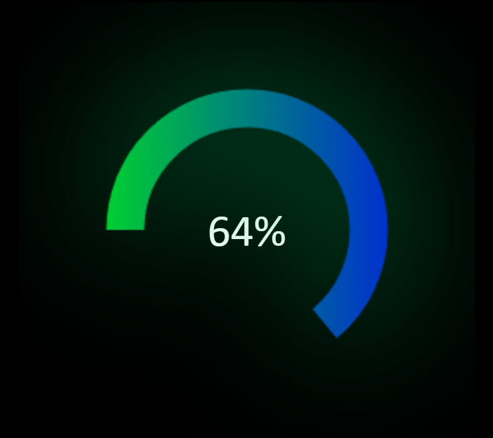

# jprogress.js
Genera un dialogo de progreso javascript


## Documentación del código
### Descripción
Este código instancia un objeto de la clase CircleProgress, y configura ciertos atributos para generar una animación en forma de círculo con un efecto de progreso.

Uso
Para utilizar este código, primero debes llamar a la clase ***CircleProgress*** y pasarle como parámetro un selector para el elemento HTML en el cual se generará la animación:

  ``` var circleProgress = new CircleProgress("#ContenteProgress");```
  
  
A continuación, se configuran los siguientes atributos:

***setAngle:*** establece el ángulo inicial de la animación en grados.

***setColors:*** establece los colores de la animación, pasando como parámetros dos cadenas de texto en formato CSS. La primera cadena de texto representa el color del arco de progreso, mientras que la segunda representa el color del arco de fondo.

***setTimeTween:*** establece la duración en segundos de la animación.

***tween: inicia*** la animación, pasando como parámetros el porcentaje de progreso y la duración en segundos de la animación.

***setShadowColor:*** establece el color de la sombra del círculo de la animación.

***setShadowBlur:*** establece el nivel de desenfoque de la sombra del círculo de la animación.

Ejemplo completo

```javascript
// Crea una instancia de la clase CircleProgress
var circleProgress = new CircleProgress("#ContenteProgress");

// Configura los atributos de la animación
circleProgress.setAngle(-90);
circleProgress.setColors("rgba(255,0,0,1)","rgba(0,0,0,0)");
circleProgress.setTimeTween(10);

// Inicia la animación con un progreso del 50%
circleProgress.tween(50,10);

// Configura la sombra del círculo de la animación
circleProgress.setShadowColor("rgba(255,0,0,.5)");
circleProgress.setShadowBlur(10);

//color de texto     
progress2.setColorLabel("rgba(255,255,255,1)");

// sombra de texto
progress2.setColorLabelShadow("rgba(0,150,255,1)");


```


